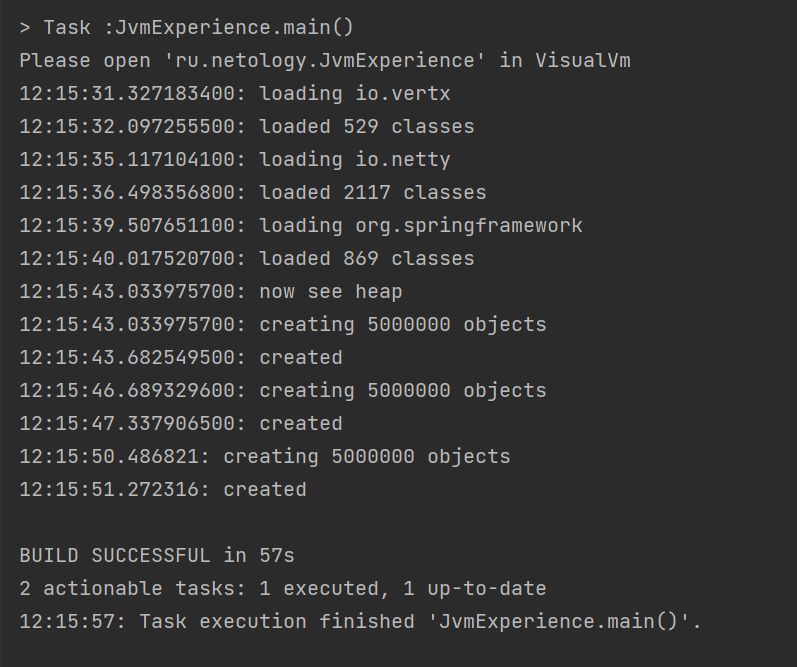

# Задача "Исследование JVM через VisualVM"

Выполнение программы:

График metaspace:

График heap:

График classes:

Описание работы программы:
1) 12:15:31.327183400: loading io.vertx -- создается множество, состоящее из объектов типа Class<?>, взятых из библиотеки io.vertx. Тем самым мы загружаем Metaspace
2) 12:15:32.097255500: loaded 529 classes
3) 12:15:35.117104100: loading io.netty -- создается множество, состоящее из объектов типа Class<?>, взятых из библиотеки loading io.netty 
4) 12:15:36.498356800: loaded 2117 classes
5) 12:15:39.507651100: loading org.springframework -- создается множество, состоящее из объектов типа Class<?>, взятых из библиотеки org.springframework
6) 12:15:40.017520700: loaded 869 classes
7) 12:15:43.033975700: now see heap
8) 12:15:43.033975700: creating 5000000 objects -- создается список из 5_000_000 объектов класса SimpleObject. Тем самым мы сильно загружаем heap. При этом Metaspace почти не увеличивается, потому что список из одинаковых объектов. 
9) 12:15:43.682549500: created
10) 12:15:46.689329600: creating 5000000 objects -- создается список из 5_000_000 объектов класса SimpleObject.
11) 12:15:47.337906500: created
12) 12:15:50.486821: creating 5000000 objects -- создается список из 5_000_000 объектов класса SimpleObject.
13) 12:15:51.272316: created

График classes показывает общее количество загруженных классов. Очень сильно коррелирует с Metaspace